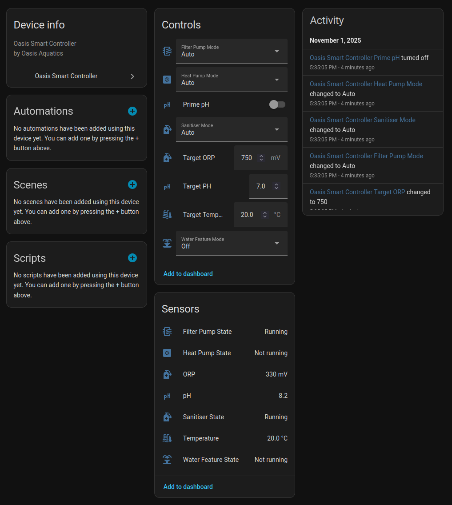

# Oasis Smart Pool Controller Home Assistant Integration

This integration supports Oasis Smart Pool Controllers sold by Sunlover Heating in Australia.

It currently exposes the following controllable entities:

- Target Temperature
- Target pH
- Target ORP
- Filter pump mode (Off, On, Auto)
- Heat pump mode (Off, On, Auto)
- Sanitiser mode (Off, On, Auto
- Water Feature mode (Off, On, Auto)
- Prime pH button

It also exposes the following sensors:

- Water Temperature
- pH level
- ORP level
- Filter pump state
- Heat pump state
- Sanitiser state
- Water feature state

# Installation

The simplest method is using 'HACS':

- Go to HACS / Integrations
- Click the 3 dots in the top right
- Select "Custom repositories"
- Add the repository URL
- Select category Integration
- Click ADD
- Now from HACS / Integrations you can find Reclaim Energy and click Download
- Restart Home Assistant

Now you can add the integration using the ADD INTERGATION button in Settings / Devices & services, search for Reclaim Energy.
It will ask you for your Unique Device ID. This is the 17 digit number found on the sticker on the controller or with the instruction booklet.
